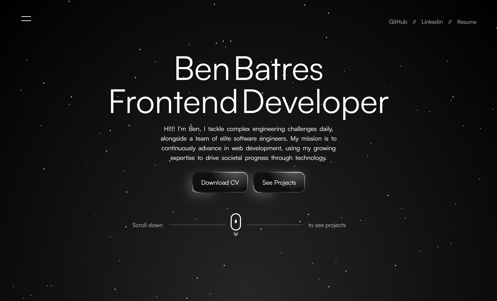

# Ben Batres | Frontend Developer
Hi! I’m Ben. I tackle complex engineering challenges daily, collaborating with talented software engineers to build high-performance, accessible, and visually stunning web applications. My mission is to continuously advance my expertise in web development and use technology to drive societal progress.

This repository contains the source code for my personal portfolio website, showcasing my skills, experience, and the digital products I've built.

## 🛠️ Tech Stack & Skills
- Frameworks & Libraries: React, Next.js, Redux
- Styling & Animation: Tailwind CSS, CSS3, HTML5, Framer Motion
- Languages & Tools: JavaScript (ES6+), Git, GitHub

## 💻 Featured Projects
### 📱 SaveSpend
- **Description:** A clean, intuitive expense tracking application designed to help users take control of their finances and visualize their spending habits.
- Tech Stack: React, Tailwind CSS

### 🧪 Skinstric
- **Description:** An advanced, AI-powered skincare analysis platform that delivers sophisticated, personalized routine recommendations.

- Tech Stack: Next.js, Tailwind CSS, AI Integration

### 🛍️ Designer E-Commerce Store
- **Description:** A sleek, high-fidelity mock e-commerce platform built to simulate a premium online shopping experience.

- Tech Stack: React, Redux, Tailwind CSS

### 🎨 Ultraverse Market
- **Description:** A modern, dynamic NFT Marketplace platform for discovering, tracking, and showcasing digital collectibles.

- Tech Stack: Next.js, Tailwind CSS

### 🎧 Summarist
- **Description:** An online audio-first platform providing quick, concise summaries of popular books and audiobooks.

- Tech Stack: React, Redux

### 🎬 Movie Api
- **Description:** A dynamic web application that fetches and displays real-time cinematic data utilizing third-party movie APIs.

- Tech Stack: JavaScript, CSS, API Integration